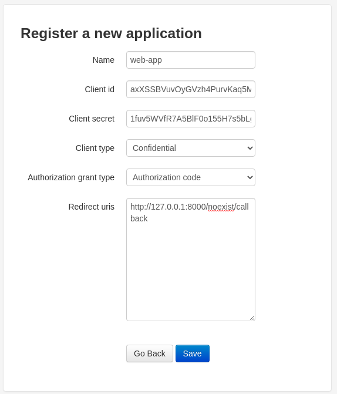

### 基于django-oauth-toolkit的统一认证流程（单点登录）

> 这篇文章主要用于django的单点登录认证，django是作为认证服务器而不是转第三方登录;  
当然， 结尾的代码也可以用于第三方认证并且django作为请求认证

在`users/models.py` 写入:
```python
from django.contrib.auth.models import AbstractUser

class User(AbstractUser):
    pass
```
settings中
```python
INSTALLED_APPS = [
    'django.contrib.admin',
    'django.contrib.auth',
    'django.contrib.contenttypes',
    'django.contrib.sessions',
    'django.contrib.messages',
    'django.contrib.staticfiles',
    'users',
]

AUTH_USER_MODEL='users.User'
```
```shell script
pip install django-oauth-toolkit
```
settings中
```python
INSTALLED_APPS = [
    'django.contrib.admin',
    'django.contrib.auth',
    'django.contrib.contenttypes',
    'django.contrib.sessions',
    'django.contrib.messages',
    'django.contrib.staticfiles',
    'users',
    'oauth2_provider',
]
```
这里如果遇到`django-oauth-toolkit`安装有问题，可以降低版本安装， 一般1.2版本没什么问题  
这里提供一下pip安装的版本作为参考  
```shell script
Django	3.2.2
django-oauth-toolkit	1.2.0	
```
```shell script
python manage.py makemigrations
python manage.py migrate
```
urls.py中
```python
from django.contrib import admin
from django.urls import include, path

urlpatterns = [
    path('admin/', admin.site.urls),
    path('auth/', include('oauth2_provider.urls', namespace='oauth2_provider')),
]
```
settings中
```python
LOGIN_URL='/admin/login/'
```
创建超级管理员
```shell script
python manage.py createsuperuser

Username: wiliam
Email address: me@wiliam.dev
Password:
Password (again):
Superuser created successfully.
```

执行django
```shell script
python manage.py runserver
```
打开网址注册需要单点登录的应用
```shell script
http://127.0.0.1:8000/auth/applications/register/
```
  
获取`client_id`和`secret`
```shell script
export ID=vW1RcAl7Mb0d5gyHNQIAcH110lWoOW2BmWJIero8
export SECRET=DZFpuNjRdt5xUEzxXovAp40bU3lQvoMvF3awEStn61RXWE0Ses4RgzHWKJKTvUCHfRkhcBi3ebsEfSjfEO96vo2Sh6pZlxJ6f7KcUbhvqMMPoVxRwv4vfdWEoWMGPeIO
```
用以下网址进行请求
```shell script
http://127.0.0.1:8000/auth/authorize/?response_type=code&client_id=vW1RcAl7Mb0d5gyHNQIAcH110lWoOW2BmWJIero8&redirect_uri=http://127.0.0.1:8000
```
登录成功后就会跳转到上面网址的 `redirect_uri`

下面是获取access_token
```python
from django.views import View
import requests

class OauthLogin(View):
    def get(self, request):
        code = request.GET.get('code')
        print('code:', code)
        url = 'http://127.0.0.1:8000/auth/token/'
        data = {
            'client_id': '4MWIs4sw6DEo0sC6PbbKqJOU4PyY1zIwMGRDvGEf',
            'client_secret': 'hRo89PCekK3lV7u5MuWcW0a28LHMWxosLIYittiBSxOz7YrM08zuYSbNK7hnULy9DIS53rzT9XTFWkD1D93r2MhX24cnt9edSphAXsmarHPJyXZ5nWh6xl0JTkSnJb0W',
            'code': code,
            'redirect_uri': 'http://127.0.0.1:8000/user/auth_login',
            'grant_type': 'authorization_code',
        }
        headers = {
            'Content-Type': 'application/x-www-form-urlencoded',
        }
        res = requests.post(url, data=data, headers=headers)
        print('res:', res.json())
        
```

- 基于认证来访问接口的方式  
header中 `Authorization` 携带上一步中的json参数`token_type`, `access_token`
```shell script
access_token = res.json().get('access_token')
token_type = res.json().get('token_type')
token_header = {
    'Authorization': '{} {}'.format(token_type, access_token)
}
res = requests.get('http://127.0.0.1:8000/user/demo/', headers=token_header)
print('res:', res.text)
```